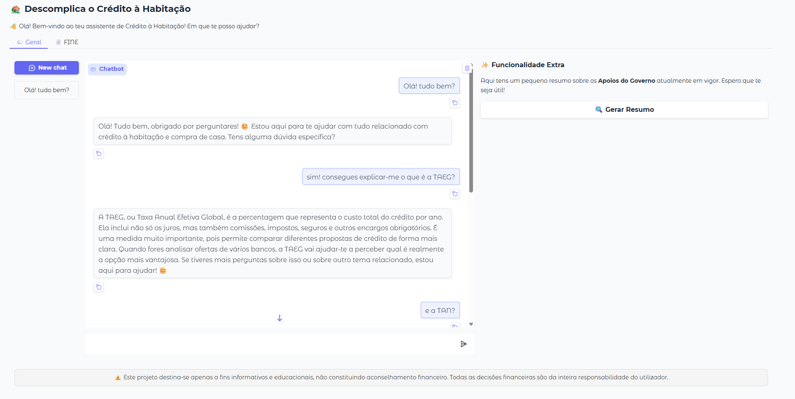
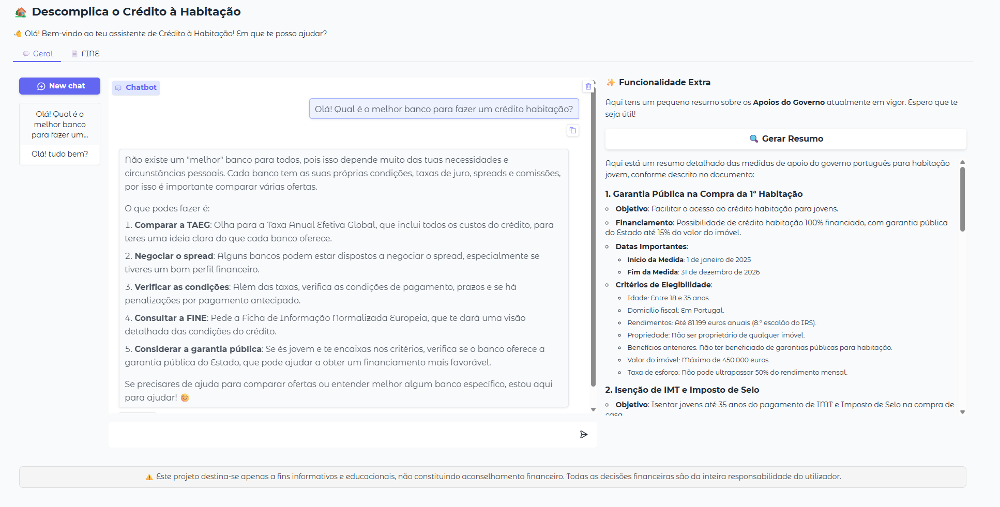
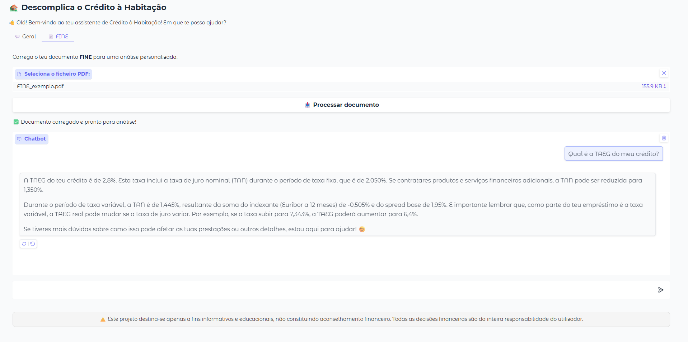

# 🏠 Projeto IA - LLMs: Descomplicar o Crédito Habitação

Um chatbot educativo pensado para ajudar os portugueses a compreender melhor o crédito à habitação e os apoios disponíveis em Portugal.
Permite responder a perguntas gerais e específicas, analisar contratos (ex: FINE) e explicar conceitos financeiros de forma clara e acessível.

> ⚠️ **Aviso:** Este projeto destina-se apenas a fins informativos e educacionais, não constituindo aconselhamento financeiro. Todas as decisões financeiras são da inteira responsabilidade do utilizador.

[](https://www.python.org/downloads/)

---

## 🎯 Funcionalidades

✅ **Perguntas gerais sobre crédito habitação**  
- Explica conceitos como TAEG, TAN, MTIC, Euribor e spread.  
- Detalha as etapas do processo de compra de casa (documentos, IMT, prazos, etc.).  
- Resume/compara apoios existentes (Garantia Pública, IMT, Porta 65 Jovem…).
  
<div align="center">
  
</div>


✅ **Perguntas específicas sobre apoios e casos práticos**  
- “Como funciona o programa Porta 65?”  
- “Quais os apoios para jovens até 35 anos?”  
- “O que preciso para pedir um crédito à habitação?”

<div align="center">
  
</div>


✅ **Análise de contratos - FINE**  
- Permite fazer upload de um PDF e fazer perguntas específicas sobre o documento, com contexto dinâmico e respostas personalizadas.

<div align="center">
  
</div>


---

## 🛠️ Tecnologias Usadas

- [OpenAI (GPT-4o, GPT-4o-mini)](https://platform.openai.com/) – motor de linguagem natural para respostas e resumos
- [LangChain](https://www.langchain.com/) – framework para Retrieval-Augmented Generation (RAG), prompt engineering e chains
- [ChromaDB](https://www.trychroma.com/) – vector store para embeddings e retrieval dinâmico de contexto
- [Gradio](https://gradio.app/) – interface web simples e intuitiva para interação com o utilizador

---

## 📁 Estrutura do Projeto

```plaintext
Projeto IA - LLMs/
├── main.py              # Interface (Gradio) e gestão da conversa
├── config.py            # Definições globais (API Key, paths, modelo)
├── data_splitters.py    # Carregamento e split de ficheiros (.md, .pdf)
├── euribor_api.py       # Consulta de taxas Euribor (requer conta premium na API Ninjas)
├── prompt_builder.py    # Criação de prompts e validação do âmbito
├── vector_store.py      # Criação e gestão do vector store (ChromaDB)
├── setup_projeto.bat    # Script de setup automático (Windows)
├── data/                # Ficheiros de dados (.md e casos práticos)
├── vector_store/        # Dados vetoriais persistidos (ChromaDB)
└── requirements.txt     # Lista de dependências
```

---

## 📚 Dados e Documentos Utilizados

- **glossario.md:** Termos essenciais de crédito à habitação, explicados com exemplos práticos.
- **documentos_necessarios.md:** Checklist de documentos obrigatórios para aprovação do crédito.
- **processo_compra_casa.md:** Guia passo-a-passo do processo de compra de casa.
- **tabelas_imt_2025.md:** Tabelas oficiais e exemplos de cálculo do IMT para 2025.
- **medidas_do_governo.md:** Resumo atualizado das principais medidas de apoio à habitação jovem.

---

## 🚀 Como Executar

1. **Pré-requisitos:**
    - Python 3.10+
    - Conta na OpenAI e API Key (para embeddings e LLM)
    - (Opcional) Conta premium na API Ninjas para consulta da Euribor em tempo real
2. **Setup automático (Windows):**
    - Executar `setup_projeto.bat` para criar ambiente virtual, instalar dependências e iniciar a aplicação
3. **Execução manual:**
    - Instalar dependências:
    ```bash
     pip install -r requirements.txt
     ```
    - Definir variáveis de ambiente (`OPENAI_API_KEY`, `API_NINJAS_KEY`)
    - Iniciar a aplicação:
     ```bash
     python main.py
     ```

---

## ⚠️ Notas Importantes

- **Atualização dos Dados:**  
O modelo depende de alguns dados fornecidos manualmente para garantir respostas atualizadas, especialmente para conteúdos sujeitos a alterações frequentes, como as tabelas de IMT, taxas ou medidas governamentais. Sempre que existirem alterações relevantes (ex: novas tabelas de IMT), é necessário atualizar os ficheiros de dados para garantir precisão nas respostas.
- **Limitação da Euribor API:**
A funcionalidade de consulta à Euribor via API Ninjas só funciona com conta premium. Sem uma subscrição premium, a função de consulta da Euribor não funciona corretamente, podendo devolver erros ou dados desatualizados.
- **Respostas apenas para crédito habitação:**
O assistente recusa perguntas fora do domínio (ex: futebol, política, metereologia).
- **Privacidade:**
Nenhum dado pessoal é armazenado. PDFs carregados são processados apenas localmente e descartados após a sessão.

---

## 📄 Exemplos de Uso

- “Qual a diferença entre TAN e TAEG?”
- “Quanto vou pagar de IMT para uma casa de 200.000€?”
- “Que documentos preciso para pedir crédito?”
- “Analisa este contrato FINE que carreguei”

---

## 👥 Público-Alvo

- Jovens adultos e famílias a comprar casa pela primeira vez em Portugal
- Quem procura comparar propostas de crédito e entender custos reais
- Utilizadores que querem respostas simples, fiáveis e práticas sobre temas financeiros complexos